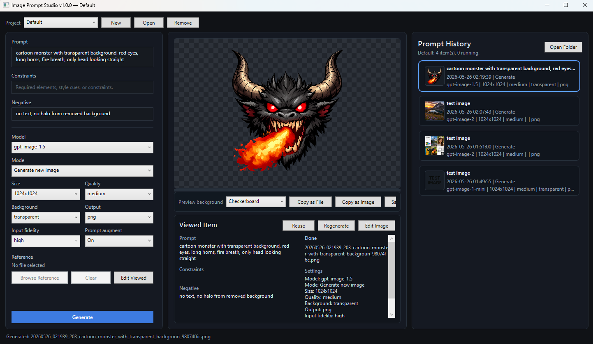

# Image Prompt Studio

A local Windows desktop app for generating and editing images with OpenAI's image models. Type a prompt, pick a model and size, click `Generate` — the image lands in the preview pane and an entry is added to history. Multiple generations can run at the same time, and every result is saved locally with the prompt and settings that produced it so you can come back to any of them later.



## Features

- **Prompt, Constraints, and Negative** fields with a separate `Constraints` box for required style cues and a `Negative` box for things to keep out.
- **All current image models** in a single dropdown — loaded from the OpenAI API at startup with a safe local fallback.
- **Per-model controls** auto-adjust to what each model supports (sizes, quality, background, output format, input fidelity, prompt augmentation).
- **Generate or Edit a reference image** — drag any `.png` / `.jpg` / `.jpeg` / `.webp` onto the window to use it as an edit reference.
- **Multiple parallel runs.** Each click of `Generate` starts a new job; history rows show `In Progress`, `Done`, `Failed`, `Canceled`, or `Missing File` independently.
- **Projects** to keep unrelated work separated. Switch, create, open, or remove projects from the top-left.
- **Persistent history** with thumbnails. Click any row to see the image plus the prompts and settings used.
- **Reuse / Regenerate / Edit** any past item — bring its prompts and settings back into the form, re-run it as-is, or use it as the edit reference for a new generation.
- **Image preview** with mouse-wheel zoom, drag-to-pan, double-click-to-fit, switchable background color, `Copy as File`, `Copy as Image`, `Save a Copy`, and `Show in Explorer`.
- **Keyboard shortcuts**: `Ctrl+Enter` to generate, `F5` to re-run the viewed item, `Delete` to remove selected history rows.
- **Month-to-date spend** in the top-left pill when the API key can read OpenAI's organization Costs API.

## Install / Run

Grab `ImagePromptStudio.exe` from the [latest release](https://github.com/limonspb/ImagePromptStudio/releases/latest) and double-click it. It's a single self-contained file — no installer, no .NET runtime, no Python.

On first launch the app prompts for `OPENAI_API_KEY` and saves it to your Windows user environment. To show OpenAI cost data, optionally set `OPENAI_ADMIN_KEY` as well (OpenAI's Costs API requires an admin key on most accounts).

All state lives in a single subfolder:

- `<exe-folder>\data\` when that folder is writable.
- `%LOCALAPPDATA%\ImagePromptStudio\` as an automatic fallback (used when the exe sits in `Program Files` or another read-only location).
- Override with `IMAGE_PROMPT_STUDIO_DATA=<path>` to put state anywhere you want.

## Build From Source

Requirements: .NET 8 SDK.

```
git clone https://github.com/limonspb/ImagePromptStudio.git
cd ImagePromptStudio
dotnet publish src\ImagePromptStudio.csproj -c Release -r win-x64 --self-contained true -o published
```

Or just double-click `build.bat`. The output is a single ~72 MB `published\ImagePromptStudio.exe` with the .NET 8 runtime bundled.

## Development

- `run.bat` — `dotnet run` with a visible console for debug output.
- `launch.vbs` — silent launcher that prefers the published exe and falls back to `dotnet run`. Useful for everyday testing without a console window.
- Dev runs and the locally published exe **share the same state** at `<repo>\test-data\`, gated by the committed `.image-prompt-studio-root` marker file at the repository root. The marker is recognised only when its first line matches the signature `image-prompt-studio-root-marker-v1`, so a stray file somewhere in your home folder cannot accidentally divert data.

## Repository Layout

```
.image-prompt-studio-root   marker that tells the app this checkout is the dev workspace
build.bat                   one-click publish into published\
launch.vbs                  silent dev launcher (uses published\ exe if present, else dotnet run)
run.bat                     dev launcher with a visible console
images/                     screenshots used in this README
src/                        all source code
    ImagePromptStudio.csproj
    App.xaml + App.xaml.cs  WPF application entry point (StartupUri = Views/MainWindow.xaml)
    AssemblyInfo.cs         WPF theme info
    Infrastructure/         shared building blocks (ObservableObject, ...)
    Models/                 plain data types (Generation*, Project*)
    Services/               app logic (image generation, history, OpenAI, paths)
    Views/                  WPF windows and dialogs
published/                  build output (gitignored)
test-data/                  dev-mode app state (gitignored, created on first run)
```

## Files And Projects

When the app starts it walks up from the executable looking for the `.image-prompt-studio-root` marker:

- **Marker found** (dev or in-repo published exe) — all state lives under `<repo>\test-data\`. Both `bin\...\ImagePromptStudio.exe` and `published\ImagePromptStudio.exe` share the same folder.
- **Marker not found** (distributed exe) — state lives under `<exe-folder>\data\` if writable, otherwise `%LOCALAPPDATA%\ImagePromptStudio\`.
- **`IMAGE_PROMPT_STUDIO_DATA`** (or legacy `IMAGE_PROMPT_STUDIO_ROOT`) — set this env var to override the data folder explicitly.

Inside the data folder:

- `projects.json` — project registry: active project plus the list of projects.
- `history.json` and `generated/` — the default project.
- `projects/<project-slug>/history.json` and `projects/<project-slug>/generated/` — non-default projects.

History entries store an absolute path to the generated PNG. If that path no longer exists (data folder moved, restored from backup, etc.) the app auto-heals by relinking to a file with the same name in the project's current `generated/` folder.

## How It Talks To OpenAI

The app calls the OpenAI Images API (`/v1/images/generations` and `/v1/images/edits`) directly over HTTPS — no Python, no external CLI, no other binaries required. The model dropdown loads available `gpt-image-*` ids from `/v1/models` at startup (dated snapshots are filtered out because they're not routable through the images endpoints) and falls back to a built-in list if that lookup fails.
